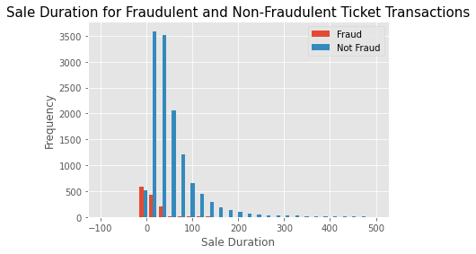

# Ticket Purchase Fraud Detection

Allan, Isabella, and Lauren

## Process Flow
Our approach to building our fraud detection model was to begin by cleaning our data, then review our feature importance, and lastly to test and potentially combine machine learning models to make the best prediction as to whether or not a ticket was fraudulent. 

## Preprocessing
Prior to building our model we reviewed the account types associated with our transactions and idenitfied which transactions were classified as fraud and which were non-fradulent. A few of the columns had information stored in dictionaries that we broke apart into seperate features to better characterize our ticket transactions. 

Reviewing our features, we noticed that several of them may pose issues for our machine learning models when creating our dummy variables. To avoid these issues, we removed several columns from our dataframe. 

After we had our final data frame we did an exploratory data analysis on our data to determine how user age, and sale duration varied with fraudulent and non-fraudulent transactions. 

    

    

The proportion of fraudulent transations was much higher for payout types that were not paid using ACH or check. 

    

## Accuracy Metrics
To measure the accuracy of both our seperate models and our Voting Classifier, we measured the precision, recall and F1 score. We also created a confusion matrix to better visualize how our model was performing. 

    

## Validation and Testing Methodology
We used a train-test-split to seperate our data into a training and testing set. Our testing set was represented by 20% of the data. Multiple models including a Random Forest, Gradient Boosted Grid Search, and XGBoost were tested and the accuracy metrics were reviewed to compare the accuracy metrics and decide which model to use.

Using a Voting Classifier we combined our three models to try to optimize detection performance. We used soft voting to weight each classifier's importance and sum them together. Although the Voting Classifier did not have the highest of each accuracy metric, it did optimize the other classifiers to improve our final confusion matrix. 

## Parameter Tuning
We began by tunning the hyperparameters of each of the three classifiers used to build the Voting Classifier and from there we assessed their individual accuracy matrics to choose the weight that each would contribute to our Voting Classifier. 

## Future Improvements