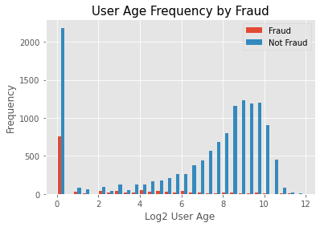

# Ticket Purchase Fraud Detection

Allan Alberts, Isabella Sun, and Lauren Schoener

## Process Flow

1. Preprocessing

    - Clean the data

        We began by cleaning the data. We removed features that we theorized were irrelevant and had a large proportion of missing observations. We also removed any tickets with missing information. We also transformed categorical variables to dummies. 

    - Exploratory data analysis
        
        We conducted an exploratory data analysis of our target variable (fraud) with key features. 

2. Compare predictive models: Random Forest, Gradient Boost, XGBoost

    We then ran three different predictive models and trained each model to determine whether a ticket is fraudulent. We compared the performance of each model on a holdout test set of data and evaluated their performance on the F1 score of each model. 

3. Grid Search Cross Validation

    We improved each model by conducting a grid search cross validation. 

4. Voting Classifier 

    Each model had its strengths, so we combined the three models into a voting classifier model

## Exploratory Data Analysis 

    

    

The proportion of fraudulent transations was much higher for payout types that were not paid using ACH or check. 

    

## Parameter Tuning
We tuned the hyperparameters of each of the three classifiers by using a grid search cross validation to find the parameters that would return the best cross validated f1 score. 

### Result of Random Forest Grid Search :
|Parameter            | Optimal | 
|----------------|---------------|
|max_depth            | 4        | 
|max_features         | sqrt     | 
|oob_score            | True     | 
|n_estimators         | 20       | 
|class_weight         | balanced | 

### Result of XGBoost Grid Search 
|Parameter            | Optimal  | 
|---------------------|----------|
|max_depth            | None     | 
|min_child_weight     | 0.1      | 
|learning_rate        | 0.5      | 

### Result of Gradient Boost Grid Search:
| Parameter            | Optimal  | 
| ---------------------|-----------|
| max_depth            | None     | 
| max_features         | sqrt     | 
|min_samples_split    | 4        | 
|min_samples_leaf     | 1        | 
|n_estimators         | 50       | 
|learning_rate        | 0.6      | 

## Validation and Testing Methodology
We used a train-test-split to seperate our data into a training and testing set. Our testing set was represented by 20% of the data. Multiple models including a Random Forest, Gradient Boosted Grid Search, and XGBoost were tested and the accuracy metrics were reviewed to compare the accuracy metrics and decide which model to use.

Using a Voting Classifier we combined our three models to try to optimize detection performance. We used soft voting to weight each classifier's importance and sum them together. Although the Voting Classifier did not have the highest of each accuracy metric, it did optimize the other classifiers to improve our final confusion matrix. 

## Performance Metrics
To measure the performance of the models, we looked at the precision, recall, and F1 scores. We focused on these scores to try to minimize the number of false negatives and false positives predicted by each model. 

    

| Random Forest        |    Score  | 
| ---------------------|-----------|
| Precision            | 0.536     | 
| Recall               | 0.926     | 
| F1                   | 0.679     | 

    

| XGBoost        |    Score  | 
| ---------------------|-----------|
| Precision            | 0.932     | 
| Recall               | 0.831     | 
| F1                   | 0.879     | 

    

| Gradient Boost        |    Score  | 
| ---------------------|-----------|
| Precision            | 0.958     | 
| Recall               | 0.797     | 
| F1                   | 0.870      | 

    

| Voting Classifier       |    Score  | 
| ---------------------|-----------|
| Precision            | 0.934     | 
| Recall               | 0.853     | 
| F1                   | 0.891     | 

We also attempted to use an isolation forest algorithm to predict fraud. The results of the isolation forest model are below. 

    

## Important Features

## Future Improvements